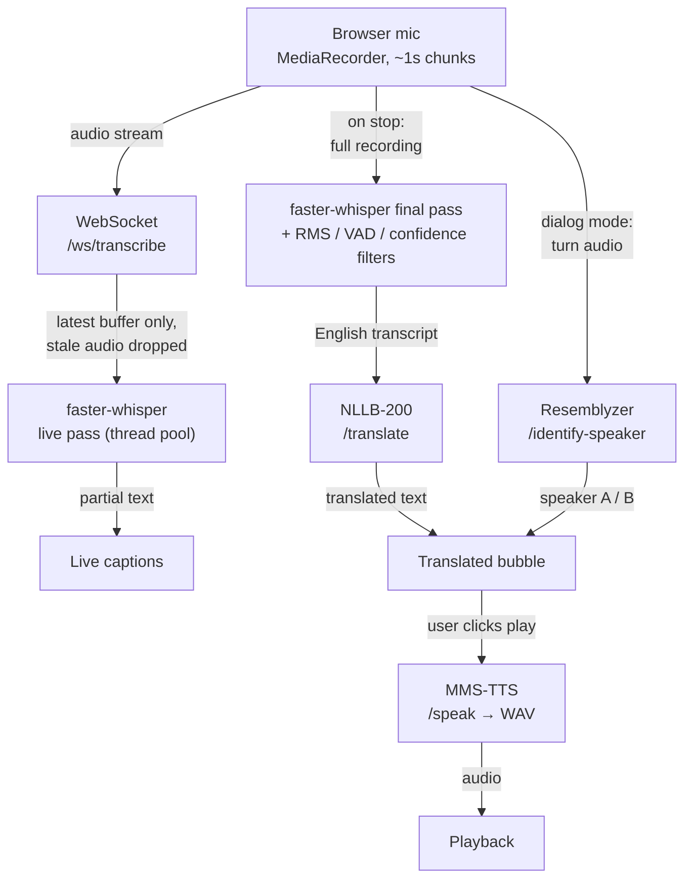

# Voice Translator

A real-time, fully self-hosted speech translation web app. Speak English into
your microphone and get it back as **text and synthesized speech** in **Uzbek,
Korean, or Russian** — with live captions appearing while you talk. It has two
modes: **Solo** for a single speaker, and **Dialog** for a two-person
conversation, where the backend automatically works out which speaker is talking
on each turn.

Every AI model runs locally — [faster-whisper](https://github.com/SYSTRAN/faster-whisper)
for speech-to-text, [NLLB-200](https://huggingface.co/facebook/nllb-200-distilled-600M)
for translation, [MMS-TTS](https://huggingface.co/facebook/mms-tts) for
text-to-speech, and [Resemblyzer](https://github.com/resemble-ai/Resemblyzer)
for speaker identification. **No paid APIs, and no audio ever leaves the
machine.** It was built as a learning / portfolio project, with most of the
effort going into the harder problems: a streaming transcription architecture
that doesn't fall behind, filtering Whisper's hallucinations on silence, and
fitting six models into 6 GB of GPU memory.


## Features

- **Streaming transcription over WebSocket.** Audio is sent to the backend
  while you speak. The server always transcribes the *most recent* buffer and
  drops any older unprocessed audio, so a slow pass can never cause a backlog —
  then it runs one clean final pass over the whole recording after you stop.
- **English → Uzbek / Korean / Russian**, delivered as both text and speech.
- **Solo and Dialog modes.** In Dialog mode, each turn's audio is embedded with
  Resemblyzer and compared (cosine similarity) against the speakers seen so far,
  labelling turns as speaker **A** or **B**.
- **Script-aware TTS preprocessing.** The MMS-TTS checkpoints expect specific
  scripts, so translated text is preprocessed before synthesis: Uzbek is
  transliterated from Latin to Cyrillic, and Korean is romanized with
  [uroman](https://github.com/isi-nlp/uroman). Russian is passed through
  directly.
- **Three-layer Whisper hallucination filtering.** Whisper will invent
  plausible sentences out of room tone. Before any text is trusted: an RMS
  energy pre-check skips near-silent buffers entirely, faster-whisper's built-in
  Silero VAD removes non-speech regions, and a per-segment check on
  `no_speech_prob` / `avg_logprob` drops low-confidence output. The streaming
  loop also disables `condition_on_previous_text` so a hallucination can't
  snowball across passes.
- **Startup model warm-up.** A FastAPI `lifespan` handler loads every model and
  runs one dummy inference through each *before* Uvicorn starts accepting
  connections, so the first real request is already warm.
- **Fully Dockerized with NVIDIA GPU passthrough**, plus a multi-stage
  Node-build → nginx image for the frontend.
- **100% local / self-hosted.** No external services, no telemetry, no API keys.

---

## Architecture

The flow for one spoken turn:

1. The browser captures the microphone with `MediaRecorder` in ~1-second
   chunks.
2. **While speaking**, chunks stream over the `/ws/transcribe` WebSocket. The
   backend keeps only the latest accumulated buffer, transcribes it in a thread
   pool (so the event loop stays responsive), and sends partial text back for
   the live captions.
3. **On stop**, the backend runs a single final Whisper pass over the complete
   recording to produce the clean transcript.
4. The transcript goes to `/translate` (NLLB-200) and comes back as
   target-language text.
5. **Dialog mode only:** the turn's audio is sent to `/identify-speaker`
   (Resemblyzer), which returns an `A` / `B` label.
6. When the user hits play, the translated text is sent to `/speak` (MMS-TTS),
   which streams back a WAV that the browser plays.



The backend is a FastAPI app; each capability lives in its own router
(`routers/`) backed by a thin model wrapper (`models/`) that owns loading and
inference. Models are module-level singletons so they load once per process.

---

## Tech stack

| Category | Technology |
| --- | --- |
| Backend framework | FastAPI, Uvicorn, WebSockets |
| Speech-to-text | faster-whisper 1.0.3 (Whisper `small`), running on CTranslate2 |
| Translation | NLLB-200 distilled 600M, via Hugging Face Transformers |
| Text-to-speech | MMS-TTS (VITS) via Transformers; uroman for Korean romanization |
| Speaker identification | Resemblyzer (`VoiceEncoder` embeddings) |
| Anti-hallucination | Silero VAD (through faster-whisper) + custom RMS & confidence filters |
| ML runtime | PyTorch 2.4 + CUDA 12.1, CTranslate2 |
| Frontend | React 19, Vite 8, Tailwind CSS 4, Axios |
| Audio capture | `MediaRecorder` / Web Audio APIs |
| Packaging | Docker, Docker Compose, NVIDIA Container Toolkit, nginx |

---

## Performance

Measured on an **NVIDIA RTX 4050 Laptop GPU (6 GB VRAM)**, CUDA 12.1, Whisper
`small` at `float16`.

### Startup warm-up — ~50 s, once, before the server accepts traffic

| Model | Warm-up time |
| --- | --- |
| Whisper (STT) | ~5 s |
| NLLB-200 (translation) | ~10–27 s (varies by run / disk cache state) |
| Resemblyzer (speaker ID) | ~3 s |
| MMS-TTS (all three languages) | ~10.6 s combined |

### Per-request latency, after warm-up

| Operation | Latency |
| --- | --- |
| Translation | ~0.5–3 s (scales with text length) |
| Speaker identification | ~0.3–0.8 s |
| Text-to-speech (several-second clip) | ~0.4 s (model already resident) |
| Live transcription pass (during speech) | ~0.3–1.2 s per WebSocket update, grows with accumulated audio |

### Why this matters

- **The warm-up pattern.** A cold FastAPI process would make the *first* user
  wait tens of seconds while NLLB alone loads. Paying that cost deliberately at
  boot — load **and** one dummy inference per model, before the port opens —
  means no user ever hits a cold model.
- **Hallucination filtering.** Left alone, Whisper turns background noise into
  confident-looking text. The RMS gate is essentially free and stops most of it;
  VAD and the `no_speech_prob` / `avg_logprob` checks catch the rest. Silence in
  produces an empty string out, not phantom words.
- **GPU memory budgeting.** Whisper, NLLB, Resemblyzer and three MMS-TTS models
  share 6 GB. That drove the choices: `float16` Whisper `small`, the distilled
  600M NLLB, and accepting that TTS models load once and stay resident rather
  than being swapped per request.

---

## Getting started

### Prerequisites

- An **NVIDIA GPU** with a driver new enough for CUDA 12.1, and enough free
  VRAM (~5 GB with everything loaded).
- For Docker: **Docker Desktop** (WSL 2 backend on Windows) or Docker Engine +
  **NVIDIA Container Toolkit**.
- For manual setup: **Python 3.10**, **Node.js 20.19+ / 22.12+**, and system
  packages `ffmpeg`, `libsndfile1`, plus a C toolchain (`build-essential`,
  `python3-dev`) for building `webrtcvad`.
- ~10 GB disk for images, plus ~3 GB for the downloaded model cache.

### Option A — Docker (recommended)

Verify GPU passthrough works first:

```bash
docker run --rm --gpus all nvidia/cuda:12.1.1-base-ubuntu22.04 nvidia-smi
```

You should see your GPU listed. Then, from the repo root:

```bash
docker compose up --build
```

- **Frontend:** http://localhost:5173
- **Backend API:** http://localhost:8000  (interactive docs at `/docs`)

Stop with `Ctrl+C`. `docker compose down` removes the containers; the model
cache lives in a named volume and survives. `docker compose down -v` wipes that
too.

**The first start is slow.** The backend downloads ~2.5 GB of weights from
Hugging Face and then warms every model up — expect a few minutes before
`[warmup] All models ready ...` appears and the API responds. Downloads are
written to the `hf-cache` volume, so every later `docker compose up` (even with
`--build`) is ready in seconds.

### Option B — Manual local development

Developed on WSL 2 (Ubuntu 22.04); the same steps work on native Linux.

**System packages** (Debian/Ubuntu):

```bash
sudo apt install -y ffmpeg libsndfile1 build-essential python3-dev
```

**Backend:**

```bash
cd backend
python3.10 -m venv venv
source venv/bin/activate
pip install --upgrade pip

# PyTorch built for CUDA 12.1 — must match your driver/toolkit
pip install torch --index-url https://download.pytorch.org/whl/cu121

pip install -r requirements.txt

# Run from backend/ so `app.main:app` resolves
uvicorn app.main:app --reload --host 0.0.0.0 --port 8000
```

On first run, model weights download to `~/.cache/huggingface` and the warm-up
runs (~50 s). Subsequent starts only pay the warm-up.

**Frontend** (in a second terminal):

```bash
cd frontend
npm install
npm run dev        # http://localhost:5173
```

The backend's CORS config already allows `http://localhost:5173`, and the
frontend already points at `http://localhost:8000`, so no further configuration
is needed for local development.

### Notes & limitations (Docker)

- **The frontend calls `http://localhost:8000` from the browser.** That works
  when the browser and the backend are on the same machine (the normal dev
  setup). To serve it elsewhere, change the API base URL in
  `frontend/src/services/api.js` and the WebSocket URL in
  `frontend/src/hooks/useLiveTranscription.js`, or put a reverse proxy in front
  of both, then rebuild the frontend image.
- **CORS:** the backend allows the origin `http://localhost:5173`
  (`backend/app/main.py`). If you change the frontend's published port, update
  that list and rebuild.
- Runs a **single Uvicorn worker** on purpose — one GPU, models loaded once at
  startup.

---

## Project structure

```
voice-translator/
├── backend/
│   ├── app/
│   │   ├── main.py            # FastAPI app + startup warm-up (lifespan handler)
│   │   ├── config.py          # model names, device, language codes, thresholds
│   │   ├── routers/           # HTTP + WebSocket endpoints
│   │   │   ├── live_transcribe.py   # WS  /ws/transcribe   — streaming STT
│   │   │   ├── transcribe.py        # POST /transcribe       — one-shot STT
│   │   │   ├── translate.py         # POST /translate        — NLLB-200
│   │   │   ├── speak.py             # POST /speak            — MMS-TTS → WAV
│   │   │   └── identify_speaker.py  # POST /identify-speaker, POST /reset-dialog
│   │   └── models/            # model loading + inference wrappers (singletons)
│   │       ├── stt.py               # faster-whisper + hallucination filtering
│   │       ├── translator.py        # NLLB-200 translation
│   │       ├── tts.py               # MMS-TTS + Uzbek/Korean script preprocessing
│   │       └── speaker_id.py        # Resemblyzer embeddings + A/B matching
│   ├── requirements.txt
│   └── Dockerfile             # nvidia/cuda 12.1 base image
├── frontend/
│   ├── src/
│   │   ├── App.jsx            # top-level mode switch (Solo / Dialog)
│   │   ├── components/        # ConversationView, MicButton, DialogBubble,
│   │   │                      #   TranscriptLine, LanguageSelector, ModeSelector…
│   │   ├── hooks/             # useLiveTranscription (WebSocket streaming STT),
│   │   │                      #   usePlayAudio, useAudioRecorder…
│   │   └── services/api.js    # Axios calls to the backend
│   ├── package.json
│   ├── Dockerfile             # Node build stage → nginx static-serve stage
│   └── nginx.conf
├── docker-compose.yml         # backend (GPU) + frontend, hf-cache named volume
└── README.md
```

---

## Known limitations & honest caveats

- **Speaker identification is heuristic.** The cosine-similarity threshold
  (`SPEAKER_SIMILARITY_THRESHOLD` in `config.py`, currently `0.70`) is sensitive
  to microphone, room acoustics, and how distinct the two voices are. Dialog
  mode only tracks two speakers (A / B), and very short or quiet turns return
  `unknown` instead of a guess. Expect to tune the threshold for your setup.
- **6 GB VRAM is tight.** Whisper `small` (fp16), NLLB-200-600M, Resemblyzer and
  all three MMS-TTS models are resident at once. If you hit CUDA OOM, drop
  `WHISPER_COMPUTE_TYPE` to `int8_float16` in `config.py`.
- **Whisper model size is `small`** — a deliberate speed/memory tradeoff for a
  laptop GPU. `medium` / `large-v3` are more accurate but slower, and won't
  co-exist with the other models in 6 GB.
- **Frontend hardcodes `localhost` URLs** for the API and WebSocket. This is
  fine for local use; see [Notes & limitations](#notes--limitations-docker) for
  serving it elsewhere.
- **English source only** (`SOURCE_LANGUAGE = "en"`). Translation targets are
  Uzbek, Korean, and Russian.
- **Single worker, single concurrent user.** This is a local/self-hosted tool,
  not a multi-tenant service.
- **Model licenses.** The weights this project downloads — **NLLB-200** and
  **MMS-TTS** — are released under **CC-BY-NC 4.0 (non-commercial use only)**.
  faster-whisper / Whisper is MIT. Your use of this project must comply with the
  individual model licenses regardless of how the code in this repo is licensed.

